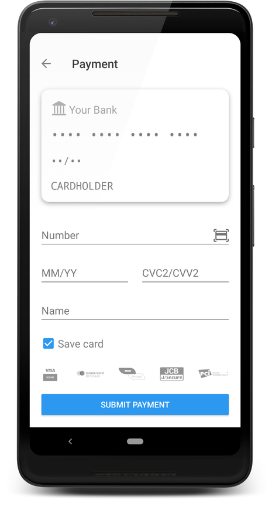
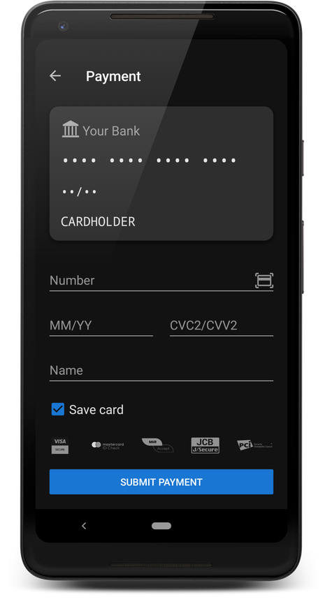
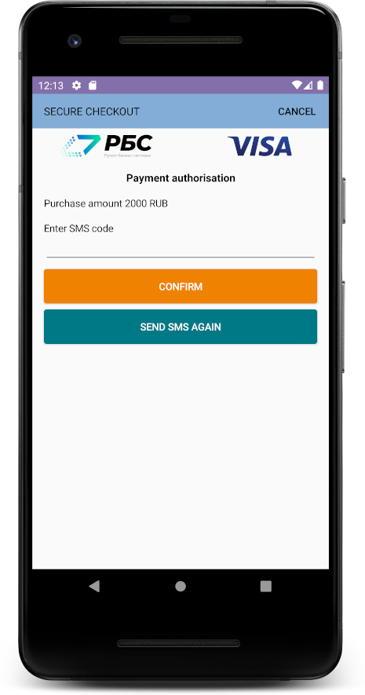

# RBS Payment SDK

## Connecting to a Gradle project by adding .aar library files

You must add the `sdk_core-release.aar` library file to the `libs` folder, then specify the dependency of the added library.

If you want to use the GUI, you should also add the `sdk_ui-release.aar` library to the `libs` folder and
indicate the dependency.

### build.gradle.kts

```kotlin
    allprojects {
        repositories {
            // ...
            flatDir {
                dirs("libs")
            }
        }
    }
    
    dependencies {
        // dependency is mandatory to add
        implementation(group = "", name = "sdk_core-release", ext = "aar")
        // if you want to use a graphical interface
        implementation(group = "", name = "sdk_ui-release", ext = "aar")
        
        implementation("org.jetbrains.kotlinx:kotlinx-coroutines-core:1.3.7")
        implementation("org.jetbrains.kotlinx:kotlinx-coroutines-android:1.3.7")
        implementation("com.caverock:androidsvg-aar:1.4")
        implementation("com.google.android.material:material:1.2.0-beta01")
        implementation("io.card:android-sdk:5.5.1")
        implementation("com.github.devnied.emvnfccard:library:3.0.1")
    }
```

### build.gradle

```groovy
    allprojects {
       repositories {
          // ...
          flatDir {
            dirs 'libs'
          }
       }
    }

    dependencies {
        // dependency is mandatory to add
        implementation(group:'', name:'sdk_core-release', ext:'aar')
        // if you want to use GUI
        implementation(group:'', name:'sdk_ui-release', ext:'aar')

        implementation("org.jetbrains.kotlinx:kotlinx-coroutines-core:1.3.7")
        implementation("org.jetbrains.kotlinx:kotlinx-coroutines-android:1.3.7")
        implementation("com.caverock:androidsvg-aar:1.4")
        implementation("com.google.android.material:material:1.2.0-beta01")
        implementation("io.card:android-sdk:5.5.1")
        implementation("com.github.devnied.emvnfccard:library:3.0.1")
    }
```

# Example Kotlin_core (no GUI)

## Example of cryptogram formation

```kotlin

import ru.rbs.mobile.payment.sdk.core.SDKCore
import ru.rbs.mobile.payment.sdk.core.TokenResult
import ru.rbs.mobile.payment.sdk.core.model.BindingParams
import ru.rbs.mobile.payment.sdk.core.model.CardParams
import ru.rbs.mobile.payment.sdk.core.validation.BaseValidator
import ru.rbs.mobile.payment.sdk.core.validation.CardCodeValidator
import ru.rbs.mobile.payment.sdk.core.validation.CardExpiryValidator
import ru.rbs.mobile.payment.sdk.core.validation.CardHolderValidator
import ru.rbs.mobile.payment.sdk.core.validation.CardNumberValidator
import ru.rbs.mobile.payment.sdk.core.validation.OrderNumberValidator

class MainActivity : AppCompatActivity() {
    // initialization of validators for card information entry fields
    private val cardNumberValidator by lazy { CardNumberValidator(this) }
    private val cardExpiryValidator by lazy { CardExpiryValidator(this) }
    private val cardCodeValidator by lazy { CardCodeValidator(this) }
    private val cardHolderValidator by lazy { CardHolderValidator(this) }
    private val orderNumberValidator by lazy { OrderNumberValidator(this) }
    private val sdkCore by lazy { SDKCore(context = this) }

    override fun onCreate(savedInstanceState: Bundle?) {
        // installation of validators on the card information entry fields
        cardNumberInput.setupValidator(cardNumberValidator)
        cardExpiryInput.setupValidator(cardExpiryValidator)
        cardCodeInput.setupValidator(cardCodeValidator)
        cardHolderInput.setupValidator(cardHolderValidator)
        mdOrderInput.setupValidator(orderNumberValidator)

        // creation of an object and initialization of fields for a new card
        val params = CardParams(
            mdOrder = mdOrderInput.text.toString(),
            pan = cardNumberInput.text.toString(),
            cvc = cardCodeInput.text.toString(),
            expiryMMYY = cardExpiryInput.text.toString(),
            cardHolder = cardHolderInput.text.toString(),
            pubKey = pubKeyInput.text.toString()
        )
        // method call to get the cryptogram for a new card
        sdkCore.generateWithCard(params)

        // Creation of an object and initialization of fields for the linked card
        val params = BindingParams(
            mdOrder = mdOrderInput.text.toString(),
            bindingID = bindingIdInput.text.toString(),
            cvc = "123",
            pubKey = pubKeyInput.text.toString()
        )
        // method call to get the cryptogram for the linked card
        sdkCore.generateWithBinding(params)
    }
}
```

# E[ample Kotlin_ui (with GUI)

## Example of cryptogram formation


```kotlin

import ru.rbs.mobile.payment.sdk.SDKPayment

class MarketApplication : Application() {

    override fun onCreate() {
        super.onCreate()
        SDKPayment.init(this)
    }
}

import ru.rbs.mobile.payment.sdk.core.model.ExpiryDate
import ru.rbs.mobile.payment.sdk.PaymentConfigBuilder
import ru.rbs.mobile.payment.sdk.ResultCallback
import ru.rbs.mobile.payment.sdk.SDKPayment
import ru.rbs.mobile.payment.sdk.model.CameraScannerOptions
import ru.rbs.mobile.payment.sdk.model.Card
import ru.rbs.mobile.payment.sdk.model.CardSaveOptions
import ru.rbs.mobile.payment.sdk.model.HolderInputOptions
import ru.rbs.mobile.payment.sdk.model.PaymentData
import ru.rbs.mobile.payment.sdk.ui.helper.Locales.english

class MainActivity : AppCompatActivity() {

    private fun executeCheckout() {
        // List of linked cards.
        val cards = setOf(
            Card("492980xxxxxx7724", "aa199a55-cf16-41b2-ac9e-cddc731edd19", ExpiryDate(2025, 12)),
            Card("558620xxxxxx6614", "6617c0b1-9976-45d9-b659-364ecac099e2", ExpiryDate(2024, 6)),
            Card("415482xxxxxx0000", "3d2d320f-ca9a-4713-977c-c852accf8a7b", ExpiryDate(2019, 1)),
            Card("411790xxxxxx123456", "ceae68c1-cb02-4804-9526-6d6b2f1f2793")
        )

        // The order ID is mandatory.
        val order = "00210bac-0ed1-474b-8ec2-5648cdfc4212"
        val paymentConfig = PaymentConfigBuilder(order)
            // Optional, by default localized transaction "Pay".
            .buttonText("Pay 200 Ꝑ")
            // Optional, by default HIDE.
            .cardSaveOptions(CardSaveOptions.YES_BY_DEFAULT)
            // Optional, by default HIDE.
            .holderInputOptions(HolderInputOptions.VISIBLE)
            // Optional, by default true.
            .bindingCVCRequired(false)
            // Optional, by default ENABLED.
            .cameraScannerOptions(CameraScannerOptions.ENABLED)
            // Optional, by default SYSTEM.
            .theme(Theme.DEFAULT)
            // Optional, local forms of payment, defined automatically.
            .locale(english())
            // Optional, by default ENABLED.
            .nfcScannerOptions(NfcScannerOptions.ENABLED)
            // Optional, by default empty list.
            .cards(cards)
            // Optional, unique payment ID, generated automatically.
            .uuid("27fb1ebf-895e-4b15-bfeb-6ecae378fe8e")
            // Optional, payment formation time, set automatically.
            .timestamp(System.currentTimeMillis())
            .build()

        // Сall payment screen.
        SDKPayment.cryptogram(this, paymentConfig)
    }

    override fun onActivityResult(requestCode: Int, resultCode: Int, data: Intent?) {
        super.onActivityResult(requestCode, resultCode, data)

        // Result handling.
        SDKPayment.handleResult(requestCode, data, object : ResultCallback<PaymentData> {

            override fun onSuccess(result: PaymentData) {
                //Cryptogram formation result.
                when {
                    result.status.isSucceeded() -> {
                        val info = result.info
                        if (info is PaymentInfoNewCard) {
                            log("New card ${info.holder} ${info.saveCard}")
                        } else if (info is PaymentInfoBindCard) {
                            log("Saved card ${info.bindingId}")
                        } else if (info is PaymentInfoGooglePay) {
                            log("Google Pay ${info.order}")
                        }
                        log("$result")
                    }
                    result.status.isCanceled() -> {
                        log("canceled")
                    }
                }
            }

            override fun onFail(e: Exception) {
                // An error occurred.
                log(e.toString())
            }
        })
    }
}
```

# Example Java_ui (with GUI)

## Example of cryptogram formation
```java

import ru.rbs.mobile.payment.sdk.SDKPayment;

public class MarketApplication extends Application {

    @Override
    public void onCreate() {
        super.onCreate();
        SDKPayment.INSTANCE.init(this);
    }
}

import ru.rbs.mobile.payment.sdk.core.model.ExpiryDate;
import ru.rbs.mobile.payment.sdk.PaymentConfigBuilder;
import ru.rbs.mobile.payment.sdk.SDKPayment;
import ru.rbs.mobile.payment.sdk.model.Card;
import ru.rbs.mobile.payment.sdk.model.CardSaveOptions;
import ru.rbs.mobile.payment.sdk.model.PaymentConfig;

public class MainActivity extends AppCompatActivity {

    private void executeCheckout() {
        // List of linked cards.
        Set<Card> cards = new HashSet();
        cards.add(new Card("492980xxxxxx7724", "ee199a55-cf16-41b2-ac9e-cc1c731edd19"));

        // The order identifier is mandatory.
        String order = "00210bac-0ed1-474b-8ec2-5648cdfc4212";
        PaymentConfig paymentConfig = new PaymentConfigBuilder(order)
                // Optional, by default localized transaction "Pay".
                .buttonText("Pay 200 Ꝑ")
                // Optional, by default HIDE.
                .cardSaveOptions(CardSaveOptions.YES_BY_DEFAULT)
                // Optional, by default SYSTEM.
                .theme(Theme.DEFAULT)
                // Optional, by default empty list.
                .cards(cards)
                // Optional, unique payment ID, generated automatically.
                .uuid("27fb1ebf-895e-4b15-bfeb-6ecae378fe8e")
                // Optional, payment formation time, set automatically.
                .timestamp(System.currentTimeMillis())
                .build();

        // Сall payment screen.
        SDKPayment.INSTANCE.cryptogram(MainActivity.this, paymentConfig);
    }

    @Override
    protected void onActivityResult(int requestCode, final int resultCode, @Nullable Intent data) {
        super.onActivityResult(requestCode, resultCode, data);

        // Result handling.
        SDKPayment.INSTANCE.handleResult(requestCode, data, new ResultCallback<PaymentData>() {
            @Override
            public void onSuccess(PaymentData result) {
                // Cryptogram formation result.
                if (result.getStatus().isSucceeded()) {
                    PaymentInfo info = result.getInfo();
                    if (info instanceof PaymentInfoNewCard) {
                        PaymentInfoNewCard newCardInfo = (PaymentInfoNewCard) info;
                        log("New card " + newCardInfo.getHolder() + " " + newCardInfo.getSaveCard());
                    } else if (info instanceof PaymentInfoBindCard) {
                        PaymentInfoBindCard bindCard = (PaymentInfoBindCard) info;
                        log("Saved card " + bindCard);
                    }
                    log(result.toString());
                } else if (result.getStatus().isCanceled()) {
                    log("canceled");
                }
            }

            @Override
            public void onFail(Exception e) {
                // An error occurred.
                log(e.toString());
            }
        });
    }
}
```

# Field validation errors

|Field|Error|Description|
|:-----------|:---------|:---------------------|
| PAN        | required | An empty field is specified  |
|            | invalid  |Invalid value    |
|            | invalid-format  | Invalid characters are used. Only numbers are available   |
| CVC        | required | An empty field is specified  |
|            | invalid  | Invalid value   |
| EXPIRY     | required | An empty field is specified  |
|            | invalid  | Invalid value   |
|            | invalid-format  | The format does not match the template MM/YY   |
| CARDHOLDER | required | An empty field is specified  |
|            | invalid  | Invalid value   |
|            | invalid-format  | Invalid characters are used. Only characters and the space bar are available   |
| BINDING_ID | required | An empty field is specified  |
|            | invalid  | Invalid value   |
| MD_ORDER   | required | An empty field is specified  |
|            | invalid  | Invalid value   |
| PUB_KEY    | required | An empty field is specified  |

### SDK configuration

If necessary, you can override the sources of key and card type information. You can
use ready-made solutions RemoteKeyProvider, RemoteCardInfoProvider. You can also use
your provider that implements the KeyProvider or CardInfoProvider interface, respectively.

```kotlin
    SDKPayment.init(
        SDKConfigBuilder(this)
            .keyProvider(
                RemoteKeyProvider("https://securepayments.sberbank.ru/payment/se/keys.do")
            )
            .cardInfoProvider(
                RemoteCardInfoProvider(
                    url = "https://mrbin.io/bins/display",
                    urlBin = "https://mrbin.io/bins/"
                )
            )
            .build()
    )
```

### Obtaining a key from a remote service

```kotlin
    SDKPayment.init(
        SDKConfigBuilder(this)
            .keyProvider(
                RemoteKeyProvider("https://securepayments.sberbank.ru/payment/se/keys.do")
            ).build()
    )
```

The service should respond in the following format:

```json
{
    "keys": [
    {
        "keyValue": "-----BEGIN PUBLIC KEY-----****-----END PUBLIC KEY-----",
            "protocolVersion": "RSA",
            "keyExpiration": 1598527672000
    }
 ]
}
```

### Receiving card information from a remote service
```kotlin
SDKPayment.init(
    SDKConfigBuilder(this)
        .cardInfoProvider(
            RemoteCardInfoProvider(
                url = "https://mrbin.io/bins/display",
                urlBin = "https://mrbin.io/bins/"
            )
        ).build()
)
```

The service should respond in the following format:

```json
{
    "backgroundColor": "#008bd0",
    "backgroundGradient": [
        "#00bcf2",
        "#004e90"
    ],
    "supportedInvertTheme": true,
    "textColor": "#fff",
    "logo": "logo/main/a559252b-3772-4b7e-817d-27b16db17580/1.svg",
    "logoInvert": "logo/invert/a559252b-3772-4b7e-817d-27b16db17580/1.svg",
    "paymentSystem": "mastercard",
    "status": "SUCCESS"
}
```

### Implementing your own providers

You can use the providers' own implementations to provide encryption key and 
card information.

```kotlin
SDKPayment.init(
        SDKConfigBuilder(this)
            .keyProvider(
                KeyProvider() {
                // TODO
                }
            )
            .cardInfoProvider(
                CardInfoProvider() {
                // TODO
                }                       
            )
            .build()
    )
```

## Stylization

To change the appearance, you need to override the following resources:

```xml
<?xml version="1.0" encoding="utf-8"?>
<resources>
    <!--primary color-->
    <color name="rbs_color_primary"></color>
    <!--primary dark color -->
    <color name="rbs_color_primaryDark"></color>
    <!--accent color (selected input field)-->
    <color name="rbs_color_accent"></color>
    <!--error text output color-->
    <color name="rbs_color_error_text"></color>
    <!--form background color-->
    <color name="rbs_color_main_background"></color>
    <!--the color of the saved card code field-->
    <color name="rbs_color_saved_card_cvc_background">#FFFFFF</color>
    <!--the color of the hint in the saved card code entry field-->
    <color name="rbs_color_saved_card_cvc_hint">#8A000000</color>
    <!--the color of the text in the saved card code input field-->
    <color name="rbs_color_saved_card_cvc_text">#808084</color>
    <!--button text color-->
    <color name="rbs_color_button_text"></color>
    <!--form text color-->
    <color name="rbs_color_text"></color>
    <!--hint text color-->
    <color name="rbs_color_hint_text"></color>
    <!--shadow color-->
    <color name="rbs_color_shadow"></color>
    <!--Default card color-->
    <color name="rbs_color_card_background"></color>
    <!--divider color in the card list-->
    <color name="rbs_color_list_divider"></color>
</resources>
```

To override the colors in the light theme, you need to override the colors in the "values" folder. And in order
to override the colors in the dark theme, you need to override the colors in the "values-night" folder.

## Google play

### Google Pay button

The SDK provides a GooglePayButton component to display a payment button using the 
Google Pay.

```xml
<ru.rbs.mobile.payment.sdk.ui.widget.GooglePayButton
                    android:id="@+id/gpayButtonXmlConfig"
                    android:layout_width="wrap_content"
                    android:layout_height="wrap_content"
                    android:layout_gravity="center_horizontal"/>
```
                    
The external view of the GooglePayButton can be customized with the following attributes:

```xml
<ru.rbs.mobile.payment.sdk.ui.widget.GooglePayButton
    app:rbs_google_pay_button_image_format="with_text"
    app:rbs_google_pay_button_background_format="shadow"/>
```

```xml
<ru.rbs.mobile.payment.sdk.ui.widget.GooglePayButton
    app:rbs_google_pay_button_image_format="without_text"
    app:rbs_google_pay_button_background_format="outlet"/>
```

### Payment via Google pay

To start paying via Google Pay, you need to prepare a payment configuration
GooglePayPaymentConfig.

```kotlin
private fun createGooglePayConfig() : GooglePayPaymentConfig {
    val paymentData =  GooglePayPaymentDataRequest.paymentDataRequestCreate {
        allowedPaymentMethods = AllowedPaymentMethods.allowedPaymentMethodsCreate {
            method {
                type = GooglePayPaymentMethod.CARD
                parameters = PaymentMethodParameters.paymentMethodParametersCreate {
                    allowedAuthMethods = mutableSetOf(
                        GooglePayAuthMethod.PAN_ONLY,
                        GooglePayAuthMethod.CRYPTOGRAM_3DS
                    )
                    allowedCardNetworks =
                        mutableSetOf(
                            GooglePayCardNetwork.AMEX,
                            GooglePayCardNetwork.DISCOVER,
                            GooglePayCardNetwork.INTERAC,
                            GooglePayCardNetwork.JCB,
                            GooglePayCardNetwork.MASTERCARD,
                            GooglePayCardNetwork.VISA
                        )
                }
                tokenizationSpecification =
                    TokenizationSpecification.tokenizationSpecificationCreate {
                        type = GoogleTokenizationSpecificationType.PAYMENT_GATEWAY
                        parameters =
                            TokenizationSpecificationParameters.tokenizationSpecificationParametersCreate {
                                gateway = "sberbank"
                                gatewayMerchantId = "sbersafe_test"
                            }
                    }
            }
        }
        transactionInfo = TransactionInfo.transactionInfoCreate {
            totalPrice = BigDecimal.valueOf(1)
            totalPriceStatus = GooglePayTotalPriceStatus.FINAL
            countryCode = "US"
            currencyCode = "USD"
            checkoutOption = GooglePayCheckoutOption.COMPLETE_IMMEDIATE_PURCHASE
        }
        merchantInfo = MerchantInfo.merchantInfoCreate {
            merchantName = "Example Merchant"
            merchantId = "01234567890123456789"
        }
    }.toJson().toString()

    return GooglePayButtonConfigBuilder(
        order = "eecbbe96-973e-422e-a220-e9fa8d6cb124",
        paymentData = PaymentDataRequest.fromJson(paymentData)
    ).testEnvironment(true)
        .build()
}
```

The `paymentData` parameter can be generated using Google documentation or you can use
GooglePayPaymentDataRequest.

Where `order` is an order identifier (it will be returned in the SDK response), and `paymentData` is
PaymentData object from Google Wallet library.

```kotlin
SDKPayment.cryptogram(this@MainActivity, googlePayConfig)
```

The results of the payment will be returned to the calling Activity.

```kotlin
override fun onActivityResult(requestCode: Int, resultCode: Int, data: Intent?) {
    super.onActivityResult(requestCode, resultCode, data)

    // Result handling.
    SDKPayment.handleResult(requestCode, data, object : ResultCallback<PaymentData> {

        override fun onSuccess(result: PaymentData) {
            // Cryptogram formation result.
            when {
                result.status.isSucceeded() -> {
                    val info = result.info
                    if (info is PaymentInfoGooglePay) {
                        log("Google Pay ${info.order}")
                    }
                    log("$result")
                }
                result.status.isCanceled() -> {
                    log("canceled")
                }
            }
        }

        override fun onFail(e: Exception) {
            // An error occurred.
            log(e.toString())
        }
    })
}
```

### Checking the possibility to pay via Google Pay

To check the possibility of making a payment via Google Pay, you can use the method 
`possiblyShowGooglePayButton`:

```kotlin
GooglePayUtils.possiblyShowGooglePayButton(
        context = this,
        paymentsClient = GooglePayUtils.createPaymentsClient(
            context = this,
            environment = WalletConstants.ENVIRONMENT_TEST
        ),
        isReadyToPayJson = JSONObject(),
        callback = object : GooglePayUtils.GooglePayCheckCallback {
            override fun onNoGooglePlayServices() {
                // No Google Play services on the device
            }

            override fun onNotReadyToRequest() {
                // the app is not ready to pay via Google Pay
            }

            override fun onReadyToRequest() {
                // the app is ready to pay via Google Pay
            }
        }
    )
```

## Functionality description

### New card payment screen

On this screen, the user can make a payment by entering the card details.  When paying, the user has an opportunity
to save the card for future payments.



### Saved card selection screen

On this screen, the user can make a payment by selecting one of the saved cards or specify the details of a new card.


### Saved card payment screen

On this screen, the user confirms the payment with the saved card. Depending on the settings, entering the card secret code 
may be mandatory or optional.


## Configuration description

### Localization 

The payment form can be displayed using the following languages:

- English
- Russian
- Ukrainian
- German
- French
- Spanish

By default, the current application language is used. If the current language is not on the list of available ones - 
English is used.

```kotlin
val paymentConfig = PaymentConfigBuilder(order)
                        .locale(english())
                        .build()
```

### Light and dark theme

The payment form supports two design themes: light and dark.

Possible setting options:

- LIGHT - light theme.
- DARK - dark theme.
- SYSTEM - The theme is selected based on the current system theme (this option works on Android 10 and higher).

```kotlin
val paymentConfig = PaymentConfigBuilder(order)
                        .theme(Theme.SYSTEM)
                        .build()
```



### Card reading via NFC

The new card details can be filled in by leaning it against the back of the phone, if the card supports contactless
payment, and the phone is equipped with NFC.
            
- ENABLED - NFC reading function is enabled
- DISABLED - NFC reading function is disabled.

If NFC reading is enabled, the NFC icon will be displayed on the new card data entry form.
If there is no NFC on the device, the icon will be hidden.

```kotlin
val paymentConfig = PaymentConfigBuilder(order)
                        .nfcScannerOptions(NfcScannerOptions.ENABLED)
                        .build()
```


If NFC is disabled on your device, tapping the NFC icon displays a dialog with a prompt to turn on
NFC with an option to go directly to the phone settings.


### Reading card details via camera

The New card details can be filled in using the phone camera. There are two options for configuring the card scanner.

- ENABLED - the card scanner function via the camera is enabled.
- DISABLED -  the card scanner function via the camera is disabled.

```kotlin
val paymentConfig = PaymentConfigBuilder(order)
                        .cameraScannerOptions(CameraScannerOptions.ENABLED)
                        .build()
```

### Button text configuration

The payment form allows you to override the text value by default. To override the button text, you need to
pass the text via the payment configuration.

```kotlin
val paymentConfig = PaymentConfigBuilder(order)
                        .buttonText("Pay 200 Ꝑ")
                        .build()
```

The text of the button must be in the language used in the application, because this text is displayed as it is and is not
translated by the payment form. If the default button text is used, it will be translated into the available languages.

### Saving a card

When you enter information about a new card, you can control the display of the switch to save the card.

- HIDE - The save card option is hidden.
- YES_BY_DEFAULT - Access card save option, default value: Yes.
- NO_BY_DEFAULT - Access card save option, default value: No.

```kotlin
val paymentConfig = PaymentConfigBuilder(order)
                        .cardSaveOptions(CardSaveOptions.YES_BY_DEFAULT)
                        .build()
```

In the response from the payment form, a field is returned indicating the user's choice - whether they want to save the card for
further payments.

### Cardholder name input field

When you enter information about a new card, you can control the display of the cardholder input field.

- HIDE - The cardholder input option is hidden.
- VISIBLE - The cardholder input option is displayed.

```kotlin
val paymentConfig = PaymentConfigBuilder(order)
                        .holderInputOptions(HolderInputOptions.VISIBLE)
                        .build()
```

### List of saved cards

If the user already has some saved cards, their list can be passed through the parameter "cards".

```kotlin
val paymentConfig = PaymentConfigBuilder(order)
                        .cards(cards)
                        .build()
```
If the list of cards is empty or missing, the payment form displays the data input screen for a new card.
If there is one or more cards on the list, the form of payment first offers to choose a card from the list or
make a payment with a new card.


### Request for a card code to pay with a saved card

If the user has chosen to pay with a saved card, he is redirected to the payment confirmation and entering the card code screen. 
By default, the card code field is required. This check can be disabled:

```kotlin
val paymentConfig = PaymentConfigBuilder(order)
                        .bindingCVCRequired(false)
                        .build()
```

In this case, the payment form will not require you to fill in the field for entering the card code. 
But if at least one digit is entered in the field, the form will require the full value.

### Payment identifier


When you create a payment configuration, the payment ID is generated automatically. If necessary, you can override it manually:

```kotlin
val paymentConfig = PaymentConfigBuilder(order)
                        .uuid("27fb1ebf-895e-4b15-bfeb-6ecae378fe8e")
                        .build()
```

### Payment execution time

When you create a payment configuration, the time of payment is fixed automatically and has the value of the current time on the 
phone. If necessary, you can override it manually:

```kotlin
val paymentConfig = PaymentConfigBuilder(order)
                        .timestamp(System.currentTimeMillis())
                        .build()
```

### Description of the saved card

When you describe a saved card, the card number may be in full format or truncated. If you indicate the full card number,
then only the first 6 and last 4 digits will be displayed, the rest of the digits will be hidden.

The binding ID is passed in the required format used by the store, its value will be returned after
completion of the payment form.

The validity period of the card is set in a separate class, to indicate the date and month, excluding the possibility to indicate only one of the
values.

Example:

```kotlin
Card("492980xxxxxx7724", "aa199a55-cf16-41b2-ac9e-cddc731edd19", ExpiryDate(2025, 12))
```

# Example of payment with 3DS

## Connecting the 3DS2 library

You need to add the `sdk_threeds-release.aar` library file to the `libs` folder, then specify the dependency on the added 
library.

### build.gradle.kts

```kotlin
    allprojects {
        repositories {
            // ...
            flatDir {
                dirs("libs")
            }
        }
    }
    
    dependencies {
        // dependency for connecting the confirmation functionality via 3DS
        implementation(group = "", name = "sdk_threeds-release", ext = "aar")
    }
```

### build.gradle

```groovy
    allprojects {
       repositories {
          // ...
          flatDir {
            dirs 'libs'
          }
       }
    }

    dependencies {
        // dependency for connecting the confirmation functionality via 3DS
        implementation(group = "", name = "sdk_threeds-release", ext = "aar")
    }
```

## Payment execution with confirmation via 3DS2

```kotlin
private val factory = Factory()

threeDS2Service = factory.newThreeDS2Service()
val configParams = factory.newConfigParameters()
val uiCustomization = factory.newUiCustomization()
threeDS2Service.initialize(
    context,
    configParams,
    "en-US",
    uiCustomization
)

val transaction = threeDS2Service.createTransaction("F000000000", "2.1.0")

//  An example of creating a transaction with deviceInfo encryption with a transmitted RSA key.
//  val rsaPem: String = ...
//  transaction = threeDS2Service.createTransactionWithRSADSKey(
//      rsaPem,
//      "2.1.0"
//   )

//   An example of creating a transaction with deviceInfo encryption with a transmitted EC key.
//   val ecPem: String = ""
//   val directoryServerID: String = ""
//   transaction = threeDS2Service.createTransactionWithECDSKey(
//       ecPem,
//       directoryServerID,
//       "2.1.0"
//    )

// Available data, to be sent to the payment gateway
val authRequestParams = transaction.authenticationRequestParameters!!
val encryptedDeviceInfo: String = authRequestParams.deviceData
val sdkTransactionID: String = authRequestParams.sdkTransactionID
val sdkAppId: String = authRequestParams.sdkAppID
val sdkEphmeralPublicKey: String = authRequestParams.sdkEphemeralPublicKey
val sdkReferenceNumber: String = authRequestParams.sdkReferenceNumber

val challengeParameters = factory.newChallengeParameters()

// Parameters for starting Challenge Flow.
challengeParameters.acsTransactionID =
    paymentOrderSecondStepResponse.threeDSAcsTransactionId
challengeParameters.acsRefNumber = paymentOrderSecondStepResponse.threeDSAcsRefNumber
challengeParameters.acsSignedContent =
    paymentOrderSecondStepResponse.threeDSAcsSignedContent
challengeParameters.set3DSServerTransactionID(paymentOrderResponse.threeDSServerTransId)

// Listener to handle the Challenge Flow execution process.
val challengeStatusReceiver: ChallengeStatusReceiver = object : ChallengeStatusReceiver {
    
    override fun cancelled() {}

    override fun protocolError(protocolErrorEvent: ProtocolErrorEvent) {}

    override fun runtimeError(runtimeErrorEvent: RuntimeErrorEvent) {}

    override fun completed(completionEvent: CompletionEvent) {}

    override fun timedout() {}
}

val timeOut = 5

// Starting Challenge Flow.
transaction.doChallenge(
    activity,
    challengeParameters,
    challengeStatusReceiver,
    timeOut
)
```

You can see a complete code sample in the file `ru.rbs.mobile.payment.sample.kotlin.threeds.ThreeDSActivity`.

Under `documentation/threeds` you can find more information describing the available `ConfigParameters` and
 `UiCustomization` parameters to customize the 3DS screen, as well as a description of the 3DS SDK server application interaction process 

Example of a confirmation code input screen:

