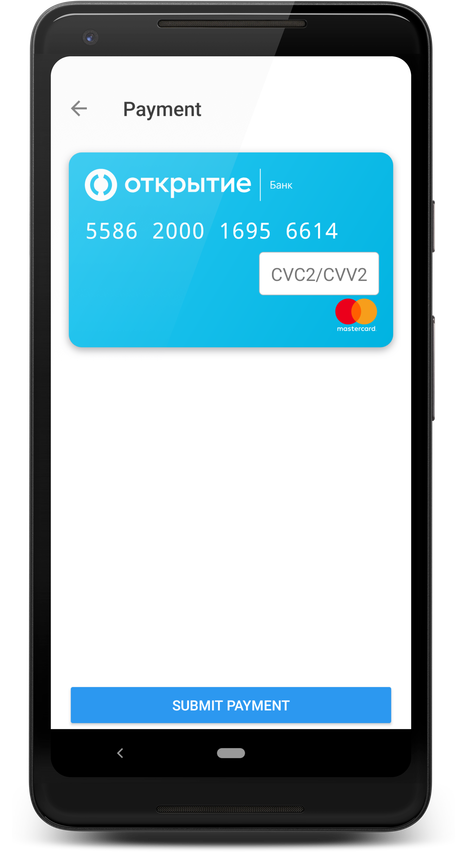

# RBS Payment SDK

## Подключение к Gradle проекту, добавлением файлов .aar библиотеки

Необходимо добавить в папку `libs` файл библиотеки `sdk_core-release.aar`, затем указать зависимость от добавленной библиотеки.

Если необходимо использовать графический интерфейс, в папку `libs` следует также добавить библиотеку `sdk_ui-release.aar` и
указать зависимость.

### build.gradle.kts

```kotlin
    allprojects {
        repositories {
            // ...
            flatDir {
                dirs("libs")
            }
        }
    }
    
    dependencies {
        // зависимость обязательна для добавления
        implementation(group = "", name = "sdk_core-release", ext = "aar")
        // если необходимо использовать графический интерфейс
        implementation(group = "", name = "sdk_ui-release", ext = "aar")
        
        implementation("org.jetbrains.kotlinx:kotlinx-coroutines-core:1.3.7")
        implementation("org.jetbrains.kotlinx:kotlinx-coroutines-android:1.3.7")
        implementation("com.caverock:androidsvg-aar:1.4")
        implementation("com.google.android.material:material:1.2.0-beta01")
        implementation("io.card:android-sdk:5.5.1")
        implementation("com.github.devnied.emvnfccard:library:3.0.1")
    }
```

### build.gradle

```groovy
    allprojects {
       repositories {
          // ...
          flatDir {
            dirs 'libs'
          }
       }
    }

    dependencies {
        // зависимость обязательна для добавления
        implementation(group:'', name:'sdk_core-release', ext:'aar')
        // если необходимо использовать графический интерфейс
        implementation(group:'', name:'sdk_ui-release', ext:'aar')

        implementation("org.jetbrains.kotlinx:kotlinx-coroutines-core:1.3.7")
        implementation("org.jetbrains.kotlinx:kotlinx-coroutines-android:1.3.7")
        implementation("com.caverock:androidsvg-aar:1.4")
        implementation("com.google.android.material:material:1.2.0-beta01")
        implementation("io.card:android-sdk:5.5.1")
        implementation("com.github.devnied.emvnfccard:library:3.0.1")
    }
```

# Пример Kotlin_core (без графического интерфейса)

## Пример формирования криптограммы

```kotlin

import ru.rbs.mobile.payment.sdk.core.SDKCore
import ru.rbs.mobile.payment.sdk.core.TokenResult
import ru.rbs.mobile.payment.sdk.core.model.BindingParams
import ru.rbs.mobile.payment.sdk.core.model.CardParams
import ru.rbs.mobile.payment.sdk.core.validation.BaseValidator
import ru.rbs.mobile.payment.sdk.core.validation.CardCodeValidator
import ru.rbs.mobile.payment.sdk.core.validation.CardExpiryValidator
import ru.rbs.mobile.payment.sdk.core.validation.CardHolderValidator
import ru.rbs.mobile.payment.sdk.core.validation.CardNumberValidator
import ru.rbs.mobile.payment.sdk.core.validation.OrderNumberValidator

class MainActivity : AppCompatActivity() {
    // инициализация валидаторов для полей ввода информации о карте
    private val cardNumberValidator by lazy { CardNumberValidator(this) }
    private val cardExpiryValidator by lazy { CardExpiryValidator(this) }
    private val cardCodeValidator by lazy { CardCodeValidator(this) }
    private val cardHolderValidator by lazy { CardHolderValidator(this) }
    private val orderNumberValidator by lazy { OrderNumberValidator(this) }
    private val sdkCore by lazy { SDKCore(context = this) }

    override fun onCreate(savedInstanceState: Bundle?) {
        // установка валидаторов на поля ввода информации о карте
        cardNumberInput.setupValidator(cardNumberValidator)
        cardExpiryInput.setupValidator(cardExpiryValidator)
        cardCodeInput.setupValidator(cardCodeValidator)
        cardHolderInput.setupValidator(cardHolderValidator)
        mdOrderInput.setupValidator(orderNumberValidator)

        // создание объекта и инициализация полей для новой карты
        val params = CardParams(
            mdOrder = mdOrderInput.text.toString(),
            pan = cardNumberInput.text.toString(),
            cvc = cardCodeInput.text.toString(),
            expiryMMYY = cardExpiryInput.text.toString(),
            cardHolder = cardHolderInput.text.toString(),
            pubKey = pubKeyInput.text.toString()
        )
        // вызов метода для получения криптограммы для новой карты
        sdkCore.generateWithCard(params)

        // создание объекта и инициализация полей для привязанной карты
        val params = BindingParams(
            mdOrder = mdOrderInput.text.toString(),
            bindingID = bindingIdInput.text.toString(),
            cvc = "123",
            pubKey = pubKeyInput.text.toString()
        )
        // вызов метода для получения криптограммы для привязанной карты
        sdkCore.generateWithBinding(params)
    }
}
```

# Пример Kotlin_ui (с графическим интерфейсом)

## Пример формирования криптограммы


```kotlin

import ru.rbs.mobile.payment.sdk.SDKPayment

class MarketApplication : Application() {

    override fun onCreate() {
        super.onCreate()
        SDKPayment.init(this)
    }
}

import ru.rbs.mobile.payment.sdk.core.model.ExpiryDate
import ru.rbs.mobile.payment.sdk.PaymentConfigBuilder
import ru.rbs.mobile.payment.sdk.ResultCallback
import ru.rbs.mobile.payment.sdk.SDKPayment
import ru.rbs.mobile.payment.sdk.model.CameraScannerOptions
import ru.rbs.mobile.payment.sdk.model.Card
import ru.rbs.mobile.payment.sdk.model.CardSaveOptions
import ru.rbs.mobile.payment.sdk.model.HolderInputOptions
import ru.rbs.mobile.payment.sdk.model.PaymentData
import ru.rbs.mobile.payment.sdk.ui.helper.Locales.english

class MainActivity : AppCompatActivity() {

    private fun executeCheckout() {
        // Список связанных карт.
        val cards = setOf(
            Card("492980xxxxxx7724", "aa199a55-cf16-41b2-ac9e-cddc731edd19", ExpiryDate(2025, 12)),
            Card("558620xxxxxx6614", "6617c0b1-9976-45d9-b659-364ecac099e2", ExpiryDate(2024, 6)),
            Card("415482xxxxxx0000", "3d2d320f-ca9a-4713-977c-c852accf8a7b", ExpiryDate(2019, 1)),
            Card("411790xxxxxx123456", "ceae68c1-cb02-4804-9526-6d6b2f1f2793")
        )

        // Идентификатор заказа обязателен.
        val order = "00210bac-0ed1-474b-8ec2-5648cdfc4212"
        val paymentConfig = PaymentConfigBuilder(order)
            // Опционально, по умолчанию локализованный перевод "Оплатить".
            .buttonText("Оплатить 200 Ꝑ")
            // Опционально, по умолчанию HIDE.
            .cardSaveOptions(CardSaveOptions.YES_BY_DEFAULT)
            // Опционально, по умолчанию HIDE.
            .holderInputOptions(HolderInputOptions.VISIBLE)
            // Опционально, по умолчанию true.
            .bindingCVCRequired(false)
            // Опционально, по умолчанию ENABLED.
            .cameraScannerOptions(CameraScannerOptions.ENABLED)
            // Опционально, по умолчанию SYSTEM.
            .theme(Theme.DEFAULT)
            // Опционально, локаль формы полаты, определяется автоматически.
            .locale(english())
            // Опционально, по умолчанию ENABLED.
            .nfcScannerOptions(NfcScannerOptions.ENABLED)
            // Опционально, по умолчанию пустой список.
            .cards(cards)
            // Опционально, уникальный идентификатор платежа, генерируется автоматически.
            .uuid("27fb1ebf-895e-4b15-bfeb-6ecae378fe8e")
            // Опционально, время формирования платежа, устанавливается автоматически.
            .timestamp(System.currentTimeMillis())
            .build()

        // Вызов экрана оплаты.
        SDKPayment.cryptogram(this, paymentConfig)
    }

    override fun onActivityResult(requestCode: Int, resultCode: Int, data: Intent?) {
        super.onActivityResult(requestCode, resultCode, data)

        // Обработка результата.
        SDKPayment.handleResult(requestCode, data, object : ResultCallback<PaymentData> {

            override fun onSuccess(result: PaymentData) {
                // Результат формирования криптограммы.
                when {
                    result.status.isSucceeded() -> {
                        val info = result.info
                        if (info is PaymentInfoNewCard) {
                            log("New card ${info.holder} ${info.saveCard}")
                        } else if (info is PaymentInfoBindCard) {
                            log("Saved card ${info.bindingId}")
                        } else if (info is PaymentInfoGooglePay) {
                            log("Google Pay ${info.order}")
                        }
                        log("$result")
                    }
                    result.status.isCanceled() -> {
                        log("canceled")
                    }
                }
            }

            override fun onFail(e: Exception) {
                // Возникла ошибка.
                log(e.toString())
            }
        })
    }
}
```

# Пример Java_ui (с графическим интерфейсом)

## Пример формирования криптограммы

```java

import ru.rbs.mobile.payment.sdk.SDKPayment;

public class MarketApplication extends Application {

    @Override
    public void onCreate() {
        super.onCreate();
        SDKPayment.INSTANCE.init(this);
    }
}

import ru.rbs.mobile.payment.sdk.core.model.ExpiryDate;
import ru.rbs.mobile.payment.sdk.PaymentConfigBuilder;
import ru.rbs.mobile.payment.sdk.SDKPayment;
import ru.rbs.mobile.payment.sdk.model.Card;
import ru.rbs.mobile.payment.sdk.model.CardSaveOptions;
import ru.rbs.mobile.payment.sdk.model.PaymentConfig;

public class MainActivity extends AppCompatActivity {

    private void executeCheckout() {
        // Список связанных карт.
        Set<Card> cards = new HashSet();
        cards.add(new Card("492980xxxxxx7724", "ee199a55-cf16-41b2-ac9e-cc1c731edd19"));

        // Идентификатор заказа обязателен.
        String order = "00210bac-0ed1-474b-8ec2-5648cdfc4212";
        PaymentConfig paymentConfig = new PaymentConfigBuilder(order)
                // Опционально, по умолчанию локализованный перевод "Оплатить".
                .buttonText("Оплатить 200 Ꝑ")
                // Опционально, по умолчанию HIDE.
                .cardSaveOptions(CardSaveOptions.YES_BY_DEFAULT)
                // Опционально, по умолчанию SYSTEM.
                .theme(Theme.DEFAULT)
                // Опционально, по умолчанию пустой список.
                .cards(cards)
                // Опционально, уникальный идентификатор платежа, генерируется автоматически.
                .uuid("27fb1ebf-895e-4b15-bfeb-6ecae378fe8e")
                // Опционально, время формирования платежа, устанавливается автоматически.
                .timestamp(System.currentTimeMillis())
                .build();

        // Вызов экрана оплаты.
        SDKPayment.INSTANCE.cryptogram(MainActivity.this, paymentConfig);
    }

    @Override
    protected void onActivityResult(int requestCode, final int resultCode, @Nullable Intent data) {
        super.onActivityResult(requestCode, resultCode, data);

        // Обработка результата.
        SDKPayment.INSTANCE.handleResult(requestCode, data, new ResultCallback<PaymentData>() {
            @Override
            public void onSuccess(PaymentData result) {
                // Результат формирования криптограммы.
                if (result.getStatus().isSucceeded()) {
                    PaymentInfo info = result.getInfo();
                    if (info instanceof PaymentInfoNewCard) {
                        PaymentInfoNewCard newCardInfo = (PaymentInfoNewCard) info;
                        log("New card " + newCardInfo.getHolder() + " " + newCardInfo.getSaveCard());
                    } else if (info instanceof PaymentInfoBindCard) {
                        PaymentInfoBindCard bindCard = (PaymentInfoBindCard) info;
                        log("Saved card " + bindCard);
                    }
                    log(result.toString());
                } else if (result.getStatus().isCanceled()) {
                    log("canceled");
                }
            }

            @Override
            public void onFail(Exception e) {
                // Возникла ошибка.
                log(e.toString());
            }
        });
    }
}
```

# Ошибки валидации полей

|Поле|Ошибка|Описание|
|:-----------|:---------|:---------------------|
| PAN        | required | Указано пустое поле  |
|            | invalid  | Некорректное значение   |
|            | invalid-format  | Используются не допустимые символы. Доступны только цифры   |
| CVC        | required | Указано пустое поле  |
|            | invalid  | Некорректное значение   |
| EXPIRY     | required | Указано пустое поле  |
|            | invalid  | Некорректное значение   |
|            | invalid-format  | Формат не соответствует шаблону MM/YY   |
| CARDHOLDER | required | Указано пустое поле  |
|            | invalid  | Некорректное значение   |
|            | invalid-format  | Используются запрещенные символы. Доступны латинские символы и пробел   |
| BINDING_ID | required | Указано пустое поле  |
|            | invalid  | Некорректное значение   |
| MD_ORDER   | required | Указано пустое поле  |
|            | invalid  | Некорректное значение   |
| PUB_KEY    | required | Указано пустое поле  |

### Конфигурация SDK

При необходимости, можно переопределить источники получения ключа и информации о типе карты. Можно
использовать готовые решения RemoteKeyProvider, RemoteCardInfoProvider. Так же можно использовать
свой провайдер, реализующий интерфейс KeyProvider или CardInfoProvider соответственно.

```kotlin
    SDKPayment.init(
        SDKConfigBuilder(this)
            .keyProvider(
                RemoteKeyProvider("https://securepayments.bank.ru/payment/se/keys.do")
            )
            .cardInfoProvider(
                RemoteCardInfoProvider(
                    url = "https://mrbin.io/bins/display",
                    urlBin = "https://mrbin.io/bins/"
                )
            )
            .build()
    )
```

### Получение ключа с удаленного сервиса

```kotlin
    SDKPayment.init(
        SDKConfigBuilder(this)
            .keyProvider(
                RemoteKeyProvider("https://securepayments.bank.ru/payment/se/keys.do")
            ).build()
    )
```

Сервис должен отвечать в следующем формате:

```json
{
    "keys": [
    {
        "keyValue": "-----BEGIN PUBLIC KEY-----****-----END PUBLIC KEY-----",
            "protocolVersion": "RSA",
            "keyExpiration": 1598527672000
    }
 ]
}
```

### Получение информации о карте с удаленного сервиса

```kotlin
SDKPayment.init(
    SDKConfigBuilder(this)
        .cardInfoProvider(
            RemoteCardInfoProvider(
                url = "https://mrbin.io/bins/display",
                urlBin = "https://mrbin.io/bins/"
            )
        ).build()
)
```

Сервис должен отвечать в следующем формате:

```json
{
    "backgroundColor": "#008bd0",
    "backgroundGradient": [
        "#00bcf2",
        "#004e90"
    ],
    "supportedInvertTheme": true,
    "textColor": "#fff",
    "logo": "logo/main/a559252b-3772-4b7e-817d-27b16db17580/1.svg",
    "logoInvert": "logo/invert/a559252b-3772-4b7e-817d-27b16db17580/1.svg",
    "paymentSystem": "mastercard",
    "status": "SUCCESS"
}
```

### Реализация собственных провайдеров

Можно использовать собственные реализации провайдеров для предоставления ключа шифрования и 
информации о карте.

```kotlin
SDKPayment.init(
        SDKConfigBuilder(this)
            .keyProvider(
                KeyProvider() {
                // TODO
                }
            )
            .cardInfoProvider(
                CardInfoProvider() {
                // TODO
                }                       
            )
            .build()
    )
```

## Стилизация

Для изменения внешнего вида нужно переопределить следующие ресурсы:

```xml
<?xml version="1.0" encoding="utf-8"?>
<resources>
    <!--основной цвет-->
    <color name="rbs_color_primary"></color>
    <!--основной темный цвет -->
    <color name="rbs_color_primaryDark"></color>
    <!--цвет акцента (выбранного поля ввода)-->
    <color name="rbs_color_accent"></color>
    <!--цвет вывода текста ошибки-->
    <color name="rbs_color_error_text"></color>
    <!--цвет фона формы-->
    <color name="rbs_color_main_background"></color>
    <!--цвет поля ввода кода сохраненной карты-->
    <color name="rbs_color_saved_card_cvc_background">#FFFFFF</color>
    <!--цвет подсказки в поле ввода кода сохраненной карты-->
    <color name="rbs_color_saved_card_cvc_hint">#8A000000</color>
    <!--цвет текста в поле ввода кода сохраненной карты-->
    <color name="rbs_color_saved_card_cvc_text">#808084</color>
    <!--цвет текста кнопки-->
    <color name="rbs_color_button_text"></color>
    <!--цвет текста формы-->
    <color name="rbs_color_text"></color>
    <!--цвет текста подсказки-->
    <color name="rbs_color_hint_text"></color>
    <!--цвет тени-->
    <color name="rbs_color_shadow"></color>
    <!--цвет карты по умолчанию-->
    <color name="rbs_color_card_background"></color>
    <!--цвет разделителя в списке карт-->
    <color name="rbs_color_list_divider"></color>
</resources>
```

Для переопределения цвета в светлой теме, необходимо переопределить цвета в папке "values". А для
переопределения цвета в темной теме, необходимо переопределить цвета в папке "values-night".

## Google play

### Кнопка оплаты через Google Pay

SDK предоставляет компонент GooglePayButton для отображения кнопки оплаты при помощи сервиса 
Google Pay.

```xml
<ru.rbs.mobile.payment.sdk.ui.widget.GooglePayButton
                    android:id="@+id/gpayButtonXmlConfig"
                    android:layout_width="wrap_content"
                    android:layout_height="wrap_content"
                    android:layout_gravity="center_horizontal"/>
```
                    
Внешнее представление GooglePayButton может бы настроено при помощи следующих аттрибутов:

```xml
<ru.rbs.mobile.payment.sdk.ui.widget.GooglePayButton
    app:rbs_google_pay_button_image_format="with_text"
    app:rbs_google_pay_button_background_format="shadow"/>
```

```xml
<ru.rbs.mobile.payment.sdk.ui.widget.GooglePayButton
    app:rbs_google_pay_button_image_format="without_text"
    app:rbs_google_pay_button_background_format="outlet"/>
```

### Проведение оплаты через Google pay

Для начала оплаты через Google Pay необходимо подготовить конфигурацию оплаты
GooglePayPaymentConfig.

```kotlin
private fun createGooglePayConfig() : GooglePayPaymentConfig {
    val paymentData =  GooglePayPaymentDataRequest.paymentDataRequestCreate {
        allowedPaymentMethods = AllowedPaymentMethods.allowedPaymentMethodsCreate {
            method {
                type = GooglePayPaymentMethod.CARD
                parameters = PaymentMethodParameters.paymentMethodParametersCreate {
                    allowedAuthMethods = mutableSetOf(
                        GooglePayAuthMethod.PAN_ONLY,
                        GooglePayAuthMethod.CRYPTOGRAM_3DS
                    )
                    allowedCardNetworks =
                        mutableSetOf(
                            GooglePayCardNetwork.AMEX,
                            GooglePayCardNetwork.DISCOVER,
                            GooglePayCardNetwork.INTERAC,
                            GooglePayCardNetwork.JCB,
                            GooglePayCardNetwork.MASTERCARD,
                            GooglePayCardNetwork.VISA
                        )
                }
                tokenizationSpecification =
                    TokenizationSpecification.tokenizationSpecificationCreate {
                        type = GoogleTokenizationSpecificationType.PAYMENT_GATEWAY
                        parameters =
                            TokenizationSpecificationParameters.tokenizationSpecificationParametersCreate {
                                gateway = "bank"
                                gatewayMerchantId = "sbersafe_test"
                            }
                    }
            }
        }
        transactionInfo = TransactionInfo.transactionInfoCreate {
            totalPrice = BigDecimal.valueOf(1)
            totalPriceStatus = GooglePayTotalPriceStatus.FINAL
            countryCode = "US"
            currencyCode = "USD"
            checkoutOption = GooglePayCheckoutOption.COMPLETE_IMMEDIATE_PURCHASE
        }
        merchantInfo = MerchantInfo.merchantInfoCreate {
            merchantName = "Example Merchant"
            merchantId = "01234567890123456789"
        }
    }.toJson().toString()

    return GooglePayButtonConfigBuilder(
        order = "eecbbe96-973e-422e-a220-e9fa8d6cb124",
        paymentData = PaymentDataRequest.fromJson(paymentData)
    ).testEnvironment(true)
        .build()
}
```

Параметр `paymentData` можно сформировать используя документацию Google или воспользоваться
GooglePayPaymentDataRequest.

Где `order` это идентификатор заказа (он будет возвращаться в ответе от SDK), а `paymentData` это
объект PaymentData из библиотеки Google Wallet.

```kotlin
SDKPayment.cryptogram(this@MainActivity, googlePayConfig)
```

Результаты оплаты будут возвращены в вызывающую Activity.

```kotlin
override fun onActivityResult(requestCode: Int, resultCode: Int, data: Intent?) {
    super.onActivityResult(requestCode, resultCode, data)

    // Обработка результата.
    SDKPayment.handleResult(requestCode, data, object : ResultCallback<PaymentData> {

        override fun onSuccess(result: PaymentData) {
            // Результат формирования криптограммы.
            when {
                result.status.isSucceeded() -> {
                    val info = result.info
                    if (info is PaymentInfoGooglePay) {
                        log("Google Pay ${info.order}")
                    }
                    log("$result")
                }
                result.status.isCanceled() -> {
                    log("canceled")
                }
            }
        }

        override fun onFail(e: Exception) {
            // Возникла ошибка.
            log(e.toString())
        }
    })
}
```

### Проверка возможности провести оплату через Google Pay

Для проверки возможности провести оплату через Google Pay можно воспользоваться методом 
`possiblyShowGooglePayButton`:

```kotlin
GooglePayUtils.possiblyShowGooglePayButton(
        context = this,
        paymentsClient = GooglePayUtils.createPaymentsClient(
            context = this,
            environment = WalletConstants.ENVIRONMENT_TEST
        ),
        isReadyToPayJson = JSONObject(),
        callback = object : GooglePayUtils.GooglePayCheckCallback {
            override fun onNoGooglePlayServices() {
                // на устройстве нет Google Play сервисов
            }

            override fun onNotReadyToRequest() {
                // приложение не готово проводить оплату через Google Pay
            }

            override fun onReadyToRequest() {
                // приложение готово проводить оплату через Google Pay
            }
        }
    )
```

## Описание функционала

### Экран оплаты новой картой

На данном экране, пользователь может провести оплату введя данные карты. При оплате у пользователя есть возможность 
сохранить карту для последующих оплат.


### Экран выбора сохраненной карты

На данном экране, пользователь может провести оплату выбрав одну из сохраненных карт или указать данные новой карты.


### Экран оплаты сохраненной картой

На данном экране, пользователь подтверждает оплату сохраненной картой. В зависимости от настроек ввод секретного кода 
карты может быть обязательным или опциональным.



## Описание конфигурации

### Локализация 

Форма оплаты может отображаться с использованием следующих языков:

- Английский
- Русский
- Украинский
- Немецкий
- Французский
- Испанский

По умолчанию, используется текущий язык приложения. Если текущий язык не входит в список доступных - 
используется Английский язык.

```kotlin
val paymentConfig = PaymentConfigBuilder(order)
                        .locale(english())
                        .build()
```

### Светлая и темная тема

Форма оплаты поддерживает две темы оформления: светлую и темную.

Возможные варианты настройки:

- LIGHT - светлая тема.
- DARK - темная тема.
- SYSTEM - тема выбирается на основе текущей темы системы (данная опция работает на Android 10 и выше).

```kotlin
val paymentConfig = PaymentConfigBuilder(order)
                        .theme(Theme.SYSTEM)
                        .build()
```


### Считывание данных карты через NFC

Данные новой карты можно заполнить прислонив ее обратной стороне телефона, если карта поддерживает бесконтактную
оплату, а телефон оснащен NFC.
            
- ENABLED - функция считывания данных через NFC включена.
- DISABLED - функция считывания данных через NFC отключена.

Если функция считывания данных через NFC включена, на форме ввода данных новой карты будет отображаться иконка NFC.
Если на устройстве отсутствует NFC - иконка будет скрыта.

```kotlin
val paymentConfig = PaymentConfigBuilder(order)
                        .nfcScannerOptions(NfcScannerOptions.ENABLED)
                        .build()
```


Если на устройстве отключена функция NFC, при нажатии на иконку NFC появится диалог с подсказкой о включении
NFC c возможностью сразу перейти в настройки телефона.


### Считывание данных карты через камеру

Данные новой карты можно заполнить используя камеру телефона. Доступны два варианта настройки сканера карты.

- ENABLED - функция сканера карты через камеру включена.
- DISABLED -  функция сканера карты через камеру отключена.

```kotlin
val paymentConfig = PaymentConfigBuilder(order)
                        .cameraScannerOptions(CameraScannerOptions.ENABLED)
                        .build()
```

### Конфигурация текста кнопки

Форма оплаты позволяет переопределить значение текста по умолчанию. Для переопределения текста кнопки, необходимо 
передать текст в через конфигурацию платежа.

```kotlin
val paymentConfig = PaymentConfigBuilder(order)
                        .buttonText("Оплатить 200 Ꝑ")
                        .build()
```

Текст кнопки должен быть передать языке используемом в приложении, так как данный текст отображается как есть и не
переводится формой оплаты. Если используется текст кнопки по умолчанию, он будет переводиться на доступные языки.

### Сохранение карты

При внесении данных о новой карте, можно управлять отображением переключателя для сохранения карты.

- HIDE - Опция сохранения карты скрыта.
- YES_BY_DEFAULT - Опция сохранения карты доступа, значение по умолчанию: Да.
- NO_BY_DEFAULT - Опция сохранения карты доступа, значение по умолчанию: Нет.

```kotlin
val paymentConfig = PaymentConfigBuilder(order)
                        .cardSaveOptions(CardSaveOptions.YES_BY_DEFAULT)
                        .build()
```

В ответе от формы оплаты возвращается поле, указывающее на выбор пользователя - хочет ли он сохранить карту для 
дальнейших платежей.

### Поле ввода имени владельца карты

При внесении данных о новой карте, можно управлять отображением поля ввода владельца карты.

- HIDE - Опция ввода владельца карты скрыта.
- VISIBLE - Опция ввода владельца отображена.

```kotlin
val paymentConfig = PaymentConfigBuilder(order)
                        .holderInputOptions(HolderInputOptions.VISIBLE)
                        .build()
```

### Список сохраненных карт

Если у пользователя уже есть сохраненные карты, их список можно передать через параметр "cards".

```kotlin
val paymentConfig = PaymentConfigBuilder(order)
                        .cards(cards)
                        .build()
```

Если список карт пустой или отсутствует, формы оплаты отображает экран ввода данных для новой карты.
В случае если есть одна и более карта в списке, формы оплаты сначала предлагает выбрать карту из списка или
произвести оплату новой картой.


### Запрос кода карты для оплаты сохраненной картой

Если пользователь выбрал оплату сохраненной картой, он перенаправляется на экран подтверждения оплаты и ввода кода 
карты. По умолчанию поле кода карты обязательно для заполнения. Данную проверку можно отключить:

```kotlin
val paymentConfig = PaymentConfigBuilder(order)
                        .bindingCVCRequired(false)
                        .build()
```

В данном случае, форма оплаты не будет требовать заполнить поле для ввода кода карты. Но если в поле будет введена хотя бы
одна цифра - форма будет требовать указать полное значение.

### Идентификатор платежа

При создании конфигурации платежа, идентификатор платежа формируется автоматически. В случае необходимости его можно 
переопределить вручную:

```kotlin
val paymentConfig = PaymentConfigBuilder(order)
                        .uuid("27fb1ebf-895e-4b15-bfeb-6ecae378fe8e")
                        .build()
```

### Время выполнения платежа

При создании конфигурации платежа, время платежа фиксируется автоматически и имеет значение текущего времени на 
телефоне. В случае необходимости его можно переопределить вручную:

```kotlin
val paymentConfig = PaymentConfigBuilder(order)
                        .timestamp(System.currentTimeMillis())
                        .build()
```

### Описание сохраненной карты

При описании сохраненной карты, номер карты может иметь полный формат или урезанный. Если передан полный номер карты,
то будут отображаться только первые 6 и последние 4 цифры, остальные цифры будут замаскированы.

Идентификатор привязки передается в необходимом формате, используемом магазином, его значение будет возвращаться после 
завершения работы формы оплаты.

Срок действия карты задается отдельным классом, для указания даты и месяца исключая возможность передать только одно из 
значений.

Пример:

```kotlin
Card("492980xxxxxx7724", "aa199a55-cf16-41b2-ac9e-cddc731edd19", ExpiryDate(2025, 12))
```

# Пример оплаты с 3DS

## Подключение библиотеки 3DS2

Необходимо добавить в папку `libs` файл библиотеки `sdk_threeds-release.aar`, затем указать зависимость от добавленной 
библиотеки.

### build.gradle.kts

```kotlin
    allprojects {
        repositories {
            // ...
            flatDir {
                dirs("libs")
            }
        }
    }
    
    dependencies {
        // зависимость для подключения функционала подтверждения через 3DS
        implementation(group = "", name = "sdk_threeds-release", ext = "aar")
    }
```

### build.gradle

```groovy
    allprojects {
       repositories {
          // ...
          flatDir {
            dirs 'libs'
          }
       }
    }

    dependencies {
        // зависимость для подключения функционала подтверждения через 3DS
        implementation(group = "", name = "sdk_threeds-release", ext = "aar")
    }
```

## Выполнение оплаты с подтверждением через 3DS2

```kotlin
private val factory = Factory()

threeDS2Service = factory.newThreeDS2Service()
val configParams = factory.newConfigParameters()
val uiCustomization = factory.newUiCustomization()
threeDS2Service.initialize(
    context,
    configParams,
    "en-US",
    uiCustomization
)

val transaction = threeDS2Service.createTransaction("F000000000", "2.1.0")

//  Пример создания транзакции с шифрованием deviceInfo переданным RSA ключом.
//  val rsaPem: String = ...
//  transaction = threeDS2Service.createTransactionWithRSADSKey(
//      rsaPem,
//      "2.1.0"
//   )

//   Пример создания транзакции с шифрованием deviceInfo переданным EC ключом.
//   val ecPem: String = ""
//   val directoryServerID: String = ""
//   transaction = threeDS2Service.createTransactionWithECDSKey(
//       ecPem,
//       directoryServerID,
//       "2.1.0"
//    )

// Доступные данные, для отправки на платежный шлюз
val authRequestParams = transaction.authenticationRequestParameters!!
val encryptedDeviceInfo: String = authRequestParams.deviceData
val sdkTransactionID: String = authRequestParams.sdkTransactionID
val sdkAppId: String = authRequestParams.sdkAppID
val sdkEphmeralPublicKey: String = authRequestParams.sdkEphemeralPublicKey
val sdkReferenceNumber: String = authRequestParams.sdkReferenceNumber

val challengeParameters = factory.newChallengeParameters()

// Параметры для запуска Challenge Flow.
challengeParameters.acsTransactionID =
    paymentOrderSecondStepResponse.threeDSAcsTransactionId
challengeParameters.acsRefNumber = paymentOrderSecondStepResponse.threeDSAcsRefNumber
challengeParameters.acsSignedContent =
    paymentOrderSecondStepResponse.threeDSAcsSignedContent
challengeParameters.set3DSServerTransactionID(paymentOrderResponse.threeDSServerTransId)

// Слушатель для обработки процесса выполнения Challenge Flow.
val challengeStatusReceiver: ChallengeStatusReceiver = object : ChallengeStatusReceiver {
    
    override fun cancelled() {}

    override fun protocolError(protocolErrorEvent: ProtocolErrorEvent) {}

    override fun runtimeError(runtimeErrorEvent: RuntimeErrorEvent) {}

    override fun completed(completionEvent: CompletionEvent) {}

    override fun timedout() {}
}

val timeOut = 5

// Запуск Challenge Flow.
transaction.doChallenge(
    activity,
    challengeParameters,
    challengeStatusReceiver,
    timeOut
)
```

Полный пример кода можно посмотреть в файле `ru.rbs.mobile.payment.sample.kotlin.threeds.ThreeDSActivity`.

В разделе `documentation/threeds` можно найти дополнительную информации с описанием доступных параметров 
`ConfigParameters` и `UiCustomization` для настройки экрана 3DS, а так же описание процесса взаимодействия 3DS SDK
серверным приложение.

Пример экрана ввода кода подтверждения:

